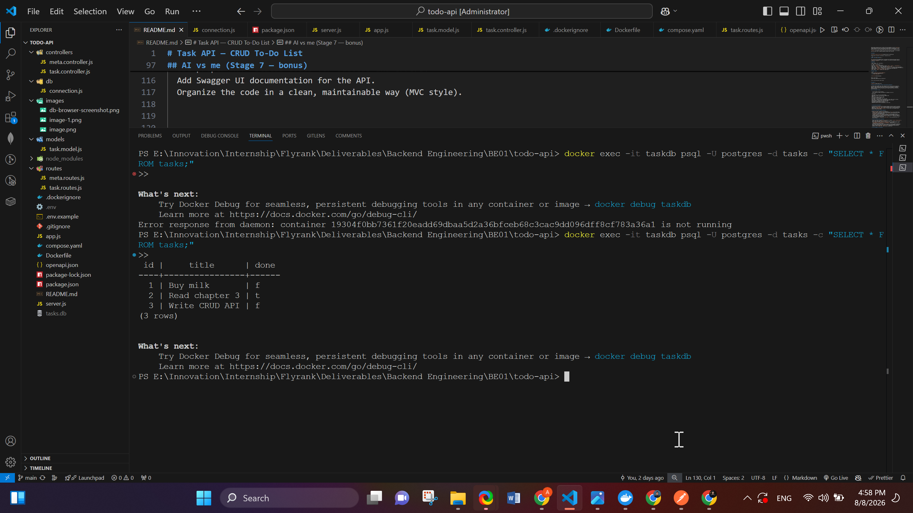

# Task API — CRUD To-Do List

A REST API that manages a to-do list with full CRUD, running against a containerized
**PostgreSQL** database via Docker Compose.
Built for FlyRank Internship — Backend Track. Currently on Assignment 3 (containerization);
built on top of Assignment 1 (in-memory) and Assignment 2 (SQLite) in the same repo.

## What this is

- A REST API with full CRUD on a to-do list, backed by **Postgres running in Docker**.
- Built with Node.js + Express (ESM modules), following an **MVC structure**:
  - `db/` — the Postgres connection pool, table creation, and one-time seed
  - `models/` — SQL queries wrapped as plain async functions (the data-access layer)
  - `controllers/` — business logic and validation for each endpoint
  - `routes/` — maps paths + HTTP methods to controllers
  - `app.js` — wires everything together
  - `server.js` — starts the server
- Interactive API docs via **Swagger UI** at `/docs`.
- The whole stack (app + database) starts with a single `docker compose up`.

## How to run

```bash
cp .env.example .env
docker compose up
```

The API runs on **http://localhost:3000**. Postgres runs in its own container, with a
named volume (`taskdata`) so your data survives `docker compose down` and `up` again.

No local Node.js install, `npm install`, or Postgres install needed — Docker handles
all of it. (If you want to run the app directly on your machine instead, without Docker,
see "Running without Docker" below.)

## Why Docker + Postgres

Assignment 1 stored tasks in memory (gone on every restart). Assignment 2 moved to
SQLite (a single file — better, but still not how real backends run). This assignment
moves to **Postgres**, a full database server — the same kind that powers most
production systems, FlyRank included.

Running Postgres in Docker means nobody installs it directly, fights version mismatches,
or hits "works on my machine" — `docker compose up` gives an identical, disposable
database in seconds, on any OS. The `taskdata` named volume is what makes the data
outlive the container: removing and recreating the container doesn't touch the volume,
so a full `docker compose down && docker compose up` still has your data.

`.env` holds the database connection string; it's git-ignored so no credentials ever
reach GitHub. `.env.example` is committed instead, showing which variables to set.

## Endpoints

All endpoints below run against Postgres. Same paths, same request/response shapes, same
status codes as Assignments 1 and 2 — only the storage layer changed underneath.

| CRUD | Method | Path | Description |
|---|---|---|---|
| — | GET | `/` | API info |
| — | GET | `/health` | Health check |
| Read | GET | `/tasks` | List all tasks |
| Read | GET | `/tasks/:id` | Get a single task (404 if not found) |
| Create | POST | `/tasks` | Create a task from `{ "title": "..." }` (400 if title missing/empty) |
| Update | PUT | `/tasks/:id` | Update a task's title and/or done (400 invalid body, 404 unknown id) |
| Delete | DELETE | `/tasks/:id` | Delete a task (204 on success, 404 unknown id) |
| Extra | GET | `/stats` | `{ total, done, open }` counts |
| Extra | POST | `/reset` | Restores the 3 seed tasks |

## Example request

```bash
curl -i -X POST http://localhost:3000/tasks \
  -H "Content-Type: application/json" \
  -d '{"title":"Buy milk"}'
```

```
HTTP/1.1 201 Created
Content-Type: application/json; charset=utf-8

{"id":4,"title":"Buy milk","done":false}
```

## Swagger UI


## Database



Example query run directly against the running container:

```bash
docker exec -it todo-api-db-1 psql -U postgres -d tasks -c "SELECT * FROM tasks;"
```

## The persistence experiment, containerized

I created a task via `POST /tasks`, then ran `docker compose down` followed by
`docker compose up`. `GET /tasks` still showed the task. This proves the data lives in
the `taskdata` volume, not inside the `db` container itself — removing and recreating
the container (which `down`/`up` does) doesn't touch the volume, so nothing was lost.

## Running without Docker (optional, local dev)

If you have Node.js and a Postgres instance available separately:

```bash
npm install
node --env-file=.env server.js
```

`.env`'s `DATABASE_URL` should point at `localhost:5432` in this mode, not `db:5432`
(that hostname only resolves inside Docker Compose's private network).

## Notes

- Data lives in Postgres, inside a Docker-managed volume — not in memory (A1) and not
  in a local file (A2).
- Parameterized queries (`$1`, `$2`, ...) are used throughout — no user input is ever
  glued directly into a SQL string.