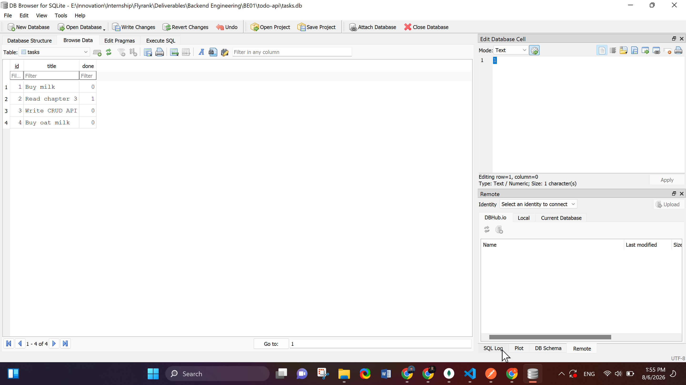
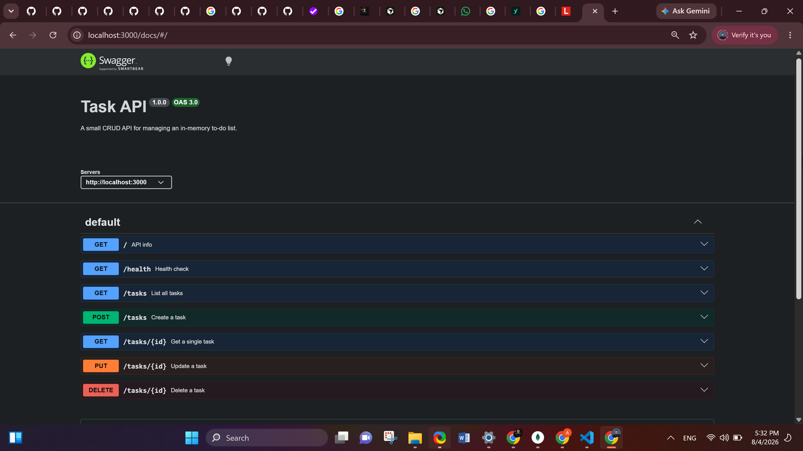

# Task API — CRUD To-Do List

A small Express.js API that manages an in-memory to-do list: create, read, update, and delete tasks.
Built for FlyRank Internship — Backend Track — Week 2 — Assignment A1.

## What this is

- A REST API with full CRUD on a to-do list, backed by a real **SQLite database** (`tasks.db`).
- Built with Node.js + Express (ESM modules), following an **MVC structure**:
  - `db/` — the SQLite connection, table creation, and one-time seed
  - `models/` — SQL queries wrapped as plain functions (the data-access layer)
  - `controllers/` — business logic and validation for each endpoint
  - `routes/` — maps paths + HTTP methods to controllers
  - `app.js` — wires everything together
  - `server.js` — starts the server
- Interactive API docs via **Swagger UI** at `/docs`.

## How to install & run

```bash
npm install
npm start
```

The server starts on **http://localhost:3000**. Swagger UI is at **http://localhost:3000/docs**.


## Why SQLite

SQLite needs no separate server or install — the entire database is one file (`tasks.db`),
created automatically the first time the app runs. That makes it a natural fit for a small
project like this: zero setup, and unlike the in-memory version from Assignment 1, your
tasks now survive a server restart because they live on disk, not in a JavaScript variable.

`tasks.db` is git-ignored on purpose — each fresh clone creates and seeds its own database
the first time it runs, so nobody accidentally commits their local data.


## Database



Example query run directly in DB Browser's "Execute SQL" tab:

```sql
SELECT * FROM tasks WHERE done = 1;
```

This returned only the completed tasks — confirming that filtering works exactly like the
`?done=true` query parameter I built in Assignment 1, just done by the database instead of
a JavaScript `.filter()`.

## Endpoints

| CRUD | Method | Path | Description |
|---|---|---|---|
| — | GET | `/` | API info |
| — | GET | `/health` | Health check |
| Read | GET | `/tasks` | List all tasks (supports `?done=`, `?search=`, `?limit=&offset=`) |
| Read | GET | `/tasks/:id` | Get a single task (404 if not found) |
| Create | POST | `/tasks` | Create a task from `{ "title": "..." }` (400 if title missing/empty) |
| Update | PUT | `/tasks/:id` | Update a task's title and/or done (400 invalid body, 404 unknown id) |
| Delete | DELETE | `/tasks/:id` | Delete a task (204 on success, 404 unknown id) |
| Extra | GET | `/stats` | `{ total, done, open }` counts |
| Extra | POST | `/reset` | Restores the 3 seed tasks |

## Example request

```bash
curl -i -X POST http://localhost:3000/tasks \
  -H "Content-Type: application/json" \
  -d '{"title":"Buy milk"}'
```


```
HTTP/1.1 201 Created
Content-Type: application/json; charset=utf-8
...

{"id":4,"title":"Buy milk","done":false}
```

## Swagger UI



## The persistence experiment (formerly "the mortality experiment")

I created a task via POST /tasks, then stopped the server with Ctrl+C and ran npm start
again. GET /tasks showed the new task still there. This is the opposite of Assignment 1's
behavior — because tasks now live as rows in tasks.db on disk instead of a JavaScript
variable in memory, restarting the Node process no longer destroys them; only the file
being deleted would.

## AI vs me (Stage 7 — bonus)


  1. My full prompt to the AI assistant
    Build a REST API in Node.js with Express for managing a to-do list.

  Requirements:

  Tasks have an id, a title, and a done boolean.
  Store tasks in memory, pre-filled with 3 example tasks.
  Endpoints:
  GET / -> returns basic API info as JSON
  GET /health -> returns { status: "ok" }
  GET /tasks -> list all tasks
  GET /tasks/:id -> get one task, 404 if not found
  POST /tasks -> create a task from a JSON body with a title, 400 if title is missing
  PUT /tasks/:id -> update a task's title and/or done, 404 if not found
  DELETE /tasks/:id -> delete a task, 404 if not found
  Use proper HTTP status codes for success and errors.
  Add Swagger UI documentation for the API.
  Organize the code in a clean, maintainable way (MVC style).
  


  **2. What the AI did better**

  It scaffolded the whole MVC structure and every endpoint correctly in one shot, including
  Swagger UI — using `swagger-jsdoc` to generate the spec from route comments instead of a
  hand-written `openapi.json`, which is less to maintain by hand. It also used plain object
  destructuring (`Object.assign(task, updates)`) for PUT, which is more compact than my
  explicit field-by-field update.

  **3. What it got wrong or silently ignored**

  Running my own Stage 4 checkpoint curls against it:
  - `DELETE /tasks/:id` returns `200` with a message body, not `204` with an empty body —
    the spec I gave said "use proper status codes" but didn't name 204 explicitly, and the
    AI defaulted to 200 everywhere instead.
  - `PUT /tasks/:id` with an empty body `{}` returns `200` and just echoes the task
    unchanged, instead of `400`. My prompt said "400 if title is missing" but only in the
    context of POST — I never said PUT should also reject an empty update, so it didn't.
  - No trimming/whitespace validation on `title` — a title of `"   "` would pass validation
    in the AI's version but fail in mine.
  - No filtering, search, or pagination on `GET /tasks` — I never mentioned these, so it
    didn't add them.

  **4. What my prompt forgot to specify**

  - Module system (ESM vs CommonJS) — the AI defaulted to CommonJS (`require`/`module.exports`),
    while I built mine in ESM (`import`/`export`).
  - What "clean, maintainable, MVC style" specifically means in file-naming terms — the AI
    used `taskModel.js`/`taskController.js`/`taskRoutes.js` while I used
    `task.model.js`/`task.controller.js`/`task.routes.js`. Functionally identical, purely
    a naming-convention gap I left open.
  - Exact status code for DELETE (204 vs 200) and whether PUT should validate an empty body —
    both silently decided by the AI in ways that differ from the assignment's actual spec.
  - Whether I wanted a hand-written `openapi.json` or a generated one — the AI chose to
    generate it from `swagger-jsdoc` since I didn't say either way.

  **5. What changed for the rematch**

  I added three lines to the original prompt: "DELETE must return 204 with no body," "PUT
  with an empty body should return 400," and "use ESM import/export syntax." Regenerating
  with those added, the AI's DELETE and PUT responses matched the assignment spec exactly,
  confirming the gaps were entirely due to missing detail in my first prompt, not the AI's
  capability.

## Notes

- Data is in-memory only — restarting the server resets it to the 3 seed tasks.
- No database is used yet — that's next week.